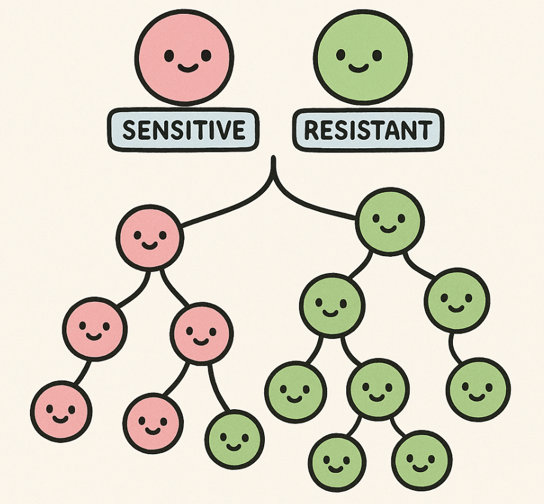

# ReversibleLB 
In this project, we study a discrete branching process with two states: sensitive and resistant, with no cell death and exponential growth.

The theory for this project is derived in 'Revisiting the Luria-Delbrück experiment: The case of reversible non-genetic resistance'.

Please reach out with questions to rohansohini2026@u.northwestern.edu
